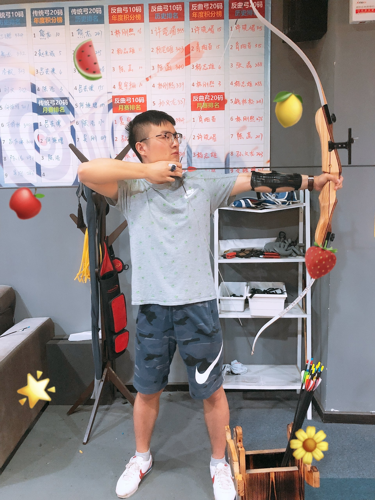

## About Me

I am an Associate Professor in the Wuhan National Laboratory for Optoelectronics (WNLO) at Huazhong University of Science and Technology (HUST) working with [Prof. Qiang Li](http://bmp.hust.edu.cn/info/1151/2222.htm). My research interest includes machine learning, computer vision and medical image analysis. 

*I am now recuriting students who are self-promotive, proactive and, improtantly, passional in the field of medical image analysis.*

Before joining WNLO in February 2021, I was working as a Postdoctoral Fellow from 08/2019 to 08/2020 in the Department of Electronic and Computer Engineering (ECE) at Hong Kong University of Science and Technology (HKUST) cooperating with [Prof. Tim Cheng](https://www.seng.ust.hk/web/eng/people_detail.php?id=326), Dean of Engineering. I was pursuing a Ph.D. degree from 2015 to 2019 in the School of Electronic Information and Communications at Huazhong University of Science and Technology (HUST) under the supervision of Associate [Prof. Xin Yang](https://sites.google.com/view/xinyang/home). I also finished a one-year Master in 2015 at HUST. Before that I received my Bachelor's degree from the School of Physics and Electronics of Central South University (CSU).

Want more about me? Please see my [CV](resume.pdf).

---

## News

* [2021-06-12] The co-first authored MICCAI paper has been accepted. Congratulations to Junlin Xian and Prof. Yang!
* [2021-06-07] The ACM MM paper is on the rebuttal.
* [2021-06-02] One co-first authored TMI paper has been submitted. Let's cross our fingers.
* [2021-04-15] One co-first authored ACM MM paper has been submitted. Let's cross our fingers.
* [2021-03-04] One co-first authored MICCAI paper has been submitted.
* [2021-03-04] One corresponding authored MICCAI paper has been submitted.
* [2020-08-25] My previous email address (eezhiweiwang@ust.hk) has been suspended! Please contact me via the new one.
* [2020-06-23] One co-authored MICCAI paper has been accepted. Congratulations to Xixi Jiang and Prof. Yang's team! Another paper is ready to resubmit.
* [2020-03-18] Two co-authored MICCAI papers have been submitted!
* [2020-03-09] Our TMI has been accepted. Congratulations!
* [2019-10-21] My previous email address (zhiweiwang@hust.edu.cn) has been suspended! Please contact me via the new one.
* [2019-10-09] The first round review of our TMI paper with a decision of major revision is completed!

---

## Contact Info

* Email: [eezhiweiwang@ust.hk](mailto:zwwang@hust.edu.cn)
* [Google Scholar](https://scholar.google.com/citations?user=LwQcmgYAAAAJ&hl=en)